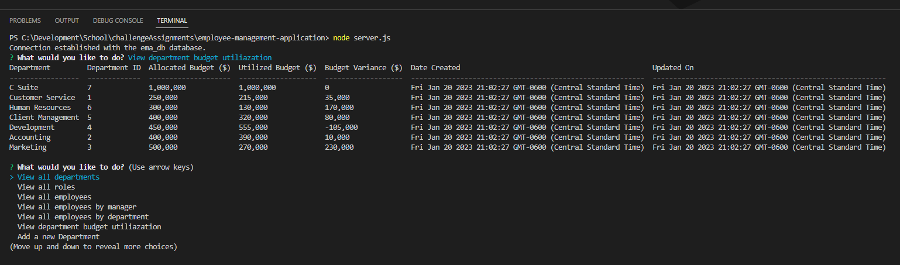

# Employee Management Application

## Badges

## Description

Below are short descriptions explaining the what, why, and how of this project.

- What was your motivation?
    - To streamline the collection and consolidate where Department, Roles, and Employee Data is stored.

- What problem does this application solve?
    - This application creates a command line prompt that allows a user to be able to manage an organization structure. This allows them to track Departments, Roles and Employees using a local database.

- What did you learn while working on this?
    - I learned how to perform CRUD (Create, Read, Update, Delete) using a local database.
    - Refreshed myself on using concats and subqueries in MySQL.
    - Learned how to parameterize queries to help reduce chance of SQL injection attacks."
    - Learned how to use the npm mysql module.
    - Learned how to use the npm module for cTables.
  
## Table of Contents

 - [Badges](#badges)
 - [Description](#description)
 - [Installation](#installation)
 - [Usage](#usage)
 - [Credits](#credits)
 - [License](#license)
 - [Features](#features)
 - [Questions](#questions)

## Installation
  
Here is some information that you will need to be able to install and properly work this application:
  - After creating a copy of this repository on your local computer, please also make sure to run "npm i".

## Usage
  
Here are some details on how this application can be used:
  - The application can be interacted with using the node CLI to view reports, create, update and delete Departments, Roles and Employees.
  - API routes have been created to allow users to perform GET calls for report data. (Note - This functionality is still in progress and does not allow to search use IDs, nor POST or DELETE API calls)
  - A Video Demo of this application can be found at:
            (PUT DEMO LINK HERE!!!!!)
      
Below a screenshot(s) of the application:
  - 
  - 

## Credits

This application used the following Third-Party technologies:
  - Watched a video on how to format values being returned (Add comma's to Money columns) in MySQL. (https://www.sqlshack.com/a-comprehensive-guide-to-the-sql-format-function/)
  - Reviewed a site to refresh how to do a SELECT on a CONCAT value. (https://www.w3resource.com/mysql/string-functions/mysql-concat-function.php)
  - Read an article on how to calculate the variance between 2 columns. (https://stackoverflow.com/questions/25329623/mysql-get-difference-between-two-values)
 
## License

The MIT license is being used for this application. For more information you can go to the following URL.
  - https://opensource.org/licenses/MIT

## Features

Some of the main features of this application are:
  - An application that allows a user to store details for their company about the Departments, Roles, and Employees.
  - This offers 6 reports that can be run to see details about the company.
  - User can Add/Delete Departments, Roles and Employees via the CLI.
  - User can Update the title, and manager of existing employees.
  - A report was built to calculate the Utilized budget by department. This will show the budget, how much of it has been used (SUM of employee Salaries), and the variance of the budget.
  - This application does support some API GET calls to be able to fetch details.